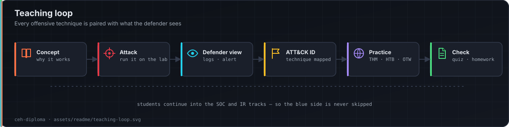
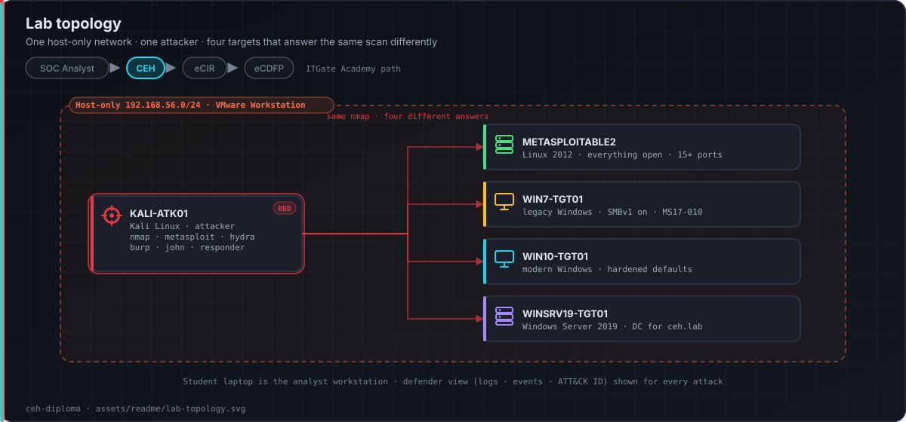

<p align="center"></p>

<p align="center">
  
  
  
  
  <a href="https://ebrahim-qareen.github.io/ceh-diploma/"></a>
</p>

Instructor-led **Certified Ethical Hacker** (EC-Council 312-50) diploma. Session pages, lab design, instructor and student materials, and a verified index of practice platforms.

Third course in the ITGate path: **SOC Analyst → CEH → eCIR → eCDFP**.

**Live site →** https://ebrahim-qareen.github.io/ceh-diploma/

## How every topic is taught

<p align="center"></p>

- **One topic map, one order** — `design/topic_map.md` decides which topic lands in which session and what it depends on.
- **One design system** — every page is built from `design/design_system.md`, so all sessions look and behave the same.
- **Attacks are taught with their detections** — each technique is paired with what the defender sees: logs, alerts, ATT&CK ID.
- **Practice you can reach** — `design/practice_platforms.md` lists TryHackMe / OverTheWire / HTB / picoCTF rooms with the access tier confirmed.
- **Per-session build logs** — `docs/session-XX/build_log.md` records what was built, verified, and still open.

## Lab

<p align="center"></p>

One host-only network. One attacker. Four targets on purpose — the same `nmap` gives a different answer on each, and that contrast is the lesson.

| Target | Era | Teaches |
|---|---|---|
| METASPLOITABLE2 | Linux, 2012 | Everything open — the richest enumeration |
| WIN7-TGT01 | Windows, legacy | SMBv1 on, MS17-010 — classic SMB enumeration still works |
| WIN10-TGT01 | Windows, modern | Hardened defaults — why the textbook output is now empty |
| WINSRV19-TGT01 | Windows Server 2019 | Domain controller for `ceh.lab` — AD attacks |

Setup guide and specs: [`labs/`](labs/).

## Repository layout

| Path | Purpose |
|---|---|
| `docs/` | Published site. `index.html` is the dashboard; `docs/session-XX/` is one session page |
| `design/topic_map.md` | Topic → session mapping and dependencies |
| `design/design_system.md` | Shared visual and interaction rules |
| `design/practice_platforms.md` | Verified external lab rooms |
| `labs/` | Lab topology and student VM setup guide |
| `exercises/` | Per-session homework, quizzes, activities |
| `knowledge_base/` | Condensed study notes per CEH module |
| `assets/readme/` | Diagrams used on this page |
| `DECISIONS.md` · `PROJECT.md` | Why things are the way they are |

Vendor PDFs are kept local only and excluded by `.gitignore`.

## Running locally

```bash
python3 -m http.server --directory docs 8000
```

No build step, no external dependencies.

## Credits and licence

Course material © ITGate Academy. Built against the EC-Council CEH v13 syllabus; vendor material is referenced, never republished. Practice platforms are linked, not rehosted.

**Ebrahim Mohamed** — Lead Cybersecurity Instructor · SOC Analyst
[LinkedIn](https://linkedin.com/in/EbrahimMohamed) · [GitHub](https://github.com/Ebrahim-Qareen)
